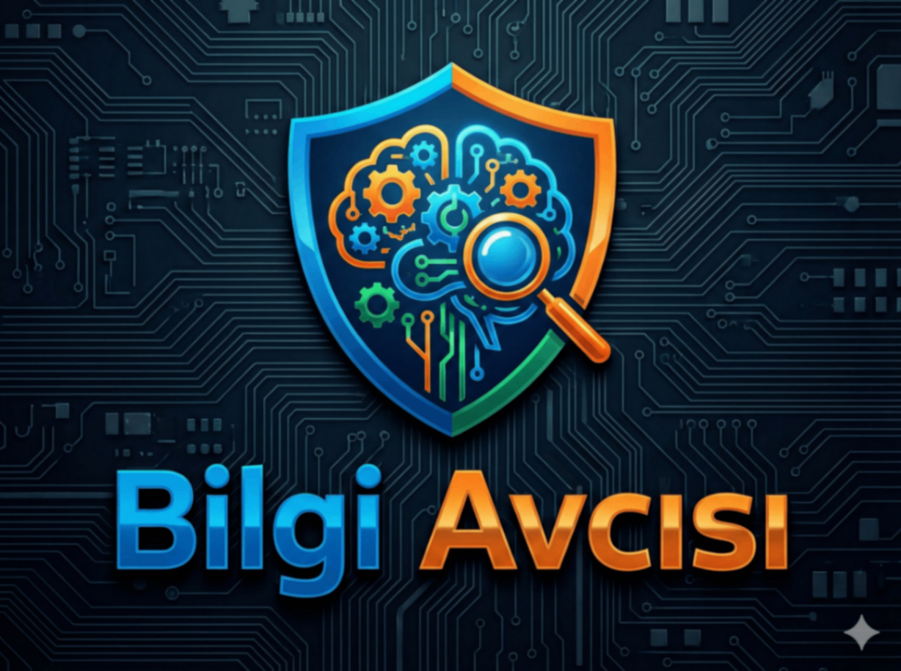

# 📚 Bilgi Avcısı

<p align="center">
  
</p>

<p align="center">
  <strong>Türk Öğrenciler İçin Etkileşimli Eğitim Uygulaması</strong>
</p>

<p align="center">
  
  
  
  
  
</p>

---

## 📋 İçindekiler

- [🎯 Proje Hakkında](#-proje-hakkında)
- [✨ Özellikler](#-özellikler)
- [🏗️ Mimari](#️-mimari)
- [📁 Proje Yapısı](#-proje-yapısı)
- [🚀 Kurulum](#-kurulum)
- [⚙️ Yapılandırma](#️-yapılandırma)
- [📱 Ekran Görüntüleri](#-ekran-görüntüleri)
- [🛠️ Teknolojiler](#️-teknolojiler)
- [🧪 Test](#-test)
- [📄 Lisans](#-lisans)

---

## 🎯 Proje Hakkında

**Bilgi Avcısı**, Türk ilkokul ve ortaokul öğrencileri için geliştirilmiş, oyunlaştırılmış bir eğitim uygulamasıdır. Uygulama, eğitimi eğlenceli hale getirerek öğrencilerin motivasyonunu artırmayı ve kalıcı öğrenme sağlamayı hedeflemektedir.

### 🎯 Hedef Kitle
- İlkokul öğrencileri (1-4. sınıf)
- Ortaokul öğrencileri (5-8. sınıf)
- Veliler ve eğitimciler

### 🌟 Vizyon
Öğrencilerin ders çalışmayı bir oyun kadar eğlenceli bulmalarını sağlayarak, akademik başarılarını artırmak.

---

## ✨ Özellikler

### 📖 Eğitim Modülleri

#### 📝 Test Sistemi
- Ders bazlı çoktan seçmeli testler
- Anlık geri bildirim ile doğru/yanlış gösterimi
- Zamanlı test modu
- Test sonuç analizi ve istatistikler
- Cevap anahtarı görüntüleme

#### 🃏 Flashcard (Bilgi Kartları)
- 3D flip animasyonlu kartlar
- Swipe mekanizması (Sol: Tekrar, Sağ: Ezberledim)
- Holografik görsel efektler
- Konu bazlı kart setleri
- İlerleme takibi

#### 📚 Ders İçerikleri
- Türkçe, Matematik, Fen Bilimleri, Sosyal Bilgiler
- Konu bazlı organizasyon
- Haftalık deneme sınavları
- İlerleme çubukları ve badge sistemi

### 🎮 Oyun Modülleri

#### ⚔️ 1v1 Düello
- Çevrimiçi/çevrimdışı düello modu
- Matchmaking sistemi
- Bilgi yarışması formatı
- Hafıza düellosu
- Tahmin oyunu düellosu

#### 🧠 Hafıza Oyunu
- Sıralı buluş modu
- Şekil eşleştirme modu
- Zorluk seviyeleri
- Skor tablosu

#### ✏️ Cümle Tamamla (Fill Blanks)
- Sürükle-bırak mekanizması
- Seviye bazlı ilerleme
- Anlık doğrulama

#### 📱 Salla Bakalım (Guess)
- Telefon sallama sensörü entegrasyonu
- Sayı tahmin oyunu
- Eğlenceli geri bildirimler

### 🐾 Maskot Sistemi

#### 🎭 Etkileşimli Maskotlar
- 6 farklı maskot karakteri:
  - 🐱 Kedi
  - 🐶 Köpek
  - 🐵 Maymun
  - 🐰 Tavşan
  - 🐯 Kaplan
  - 🚀 Astronot
- Lottie animasyonları
- Dokunma etkileşimleri
- Motivasyon sözleri

### 🔔 Bildirim Sistemi

#### 📬 Akıllı Bildirimler
- Günlük hatırlatıcılar
- Çalışma motivasyonu bildirimleri
- Oyun davetleri
- Bildirim geçmişi
- Kanal bazlı kategorizasyon

### 👤 Kullanıcı Profili

#### 🏆 Gamification
- XP (Deneyim Puanı) sistemi
- Seviye atlama mekanizması
- Başarı rozetleri
- Seri (streak) takibi
- Liderlik tabloları

#### 📊 İstatistikler
- Günlük çalışma süresi takibi
- Doğru/yanlış oranları
- Ders bazlı performans analizi
- Haftalık/aylık grafikler

### 🎨 Kullanıcı Deneyimi

#### 🌓 Tema Desteği
- Açık tema (Light Mode)
- Koyu tema (Dark Mode)
- Otomatik tema geçişi

#### ✨ Animasyonlar
- Glassmorphism UI tasarımı
- Neon efektleri
- Sinematik geçişler
- Confetti kutlamalar
- Floating navigation dock

---

## 🏗️ Mimari

Proje, **Clean Architecture** prensiplerine dayalı modüler bir yapı kullanmaktadır.

```
┌─────────────────────────────────────────────────────────────┐
│                     Presentation Layer                       │
│  ┌─────────────┐  ┌─────────────┐  ┌─────────────┐         │
│  │   Screens   │  │   Widgets   │  │  Providers  │         │
│  └─────────────┘  └─────────────┘  └─────────────┘         │
├─────────────────────────────────────────────────────────────┤
│                      Domain Layer                            │
│  ┌─────────────┐  ┌─────────────┐  ┌─────────────┐         │
│  │  Entities   │  │ Repositories│  │  Use Cases  │         │
│  │             │  │ (Interface) │  │             │         │
│  └─────────────┘  └─────────────┘  └─────────────┘         │
├─────────────────────────────────────────────────────────────┤
│                       Data Layer                             │
│  ┌─────────────┐  ┌─────────────┐  ┌─────────────┐         │
│  │   Models    │  │ Repositories│  │Data Sources │         │
│  │  (Freezed)  │  │   (Impl)    │  │(SQLite/Fire)│         │
│  └─────────────┘  └─────────────┘  └─────────────┘         │
└─────────────────────────────────────────────────────────────┘
```

### State Management
- **Flutter Riverpod** - Reaktif state yönetimi
- **Provider** - Dependency injection
- **ValueNotifier** - Basit state değişiklikleri

### Veri Modelleri
- **Freezed** - Immutable data classes
- **JSON Serializable** - JSON dönüşümleri

---

## 📁 Proje Yapısı

```
lib/
├── main.dart                    # Uygulama giriş noktası
├── firebase_options.dart        # Firebase yapılandırması
│
├── core/                        # Çekirdek modüller
│   ├── constants/              # Sabitler
│   │   ├── app_constants.dart  # Uygulama sabitleri
│   │   └── lesson_weights.dart # Ders ağırlıkları
│   ├── gamification/           # Oyunlaştırma mantığı
│   │   ├── mascot_logic.dart   # Maskot davranışları
│   │   └── mascot_phrases.dart # Maskot sözleri
│   ├── providers/              # Global provider'lar
│   │   ├── auth_provider.dart
│   │   ├── sync_provider.dart
│   │   └── user_provider.dart
│   ├── utils/                  # Yardımcı araçlar
│   │   └── logger.dart
│   └── navigator_key.dart      # Global navigator key
│
├── features/                    # Feature-based modüller
│   ├── auth/                   # Kimlik doğrulama
│   │   ├── data/repositories/
│   │   └── domain/repositories/
│   │
│   ├── duel/                   # Düello sistemi
│   │   ├── data/
│   │   ├── domain/
│   │   ├── logic/
│   │   └── presentation/
│   │       ├── screens/
│   │       │   ├── duel_game_screen.dart
│   │       │   ├── duel_game_selection_screen.dart
│   │       │   ├── duel_guess_game_screen.dart
│   │       │   ├── duel_memory_game_screen.dart
│   │       │   ├── duel_selection_screen.dart
│   │       │   └── matchmaking_screen.dart
│   │       └── widgets/
│   │
│   ├── exam/                   # Sınav modülü
│   │   ├── data/
│   │   ├── domain/
│   │   └── presentation/
│   │       ├── screens/
│   │       │   ├── exam_screen.dart
│   │       │   ├── weekly_exam_screen.dart
│   │       │   └── weekly_exam_result_screen.dart
│   │       └── widgets/
│   │
│   ├── games/                  # Oyun modülleri
│   │   ├── fill_blanks/        # Cümle tamamla
│   │   │   ├── domain/entities/
│   │   │   └── presentation/screens/
│   │   ├── guess/              # Salla bakalım
│   │   │   ├── data/
│   │   │   ├── domain/entities/
│   │   │   └── presentation/
│   │   │       ├── controllers/
│   │   │       ├── screens/
│   │   │       └── widgets/
│   │   └── memory/             # Hafıza oyunu
│   │       ├── domain/entities/
│   │       └── presentation/
│   │           ├── controllers/
│   │           ├── screens/
│   │           └── widgets/
│   │
│   ├── mascot/                 # Maskot sistemi
│   │   ├── data/
│   │   ├── domain/
│   │   └── presentation/
│   │       ├── providers/
│   │       ├── screens/
│   │       │   └── pet_selection_screen.dart
│   │       └── widgets/
│   │
│   ├── sync/                   # Veri senkronizasyonu
│   │   ├── domain/
│   │   │   ├── models/
│   │   │   └── repositories/
│   │   └── presentation/
│   │
│   ├── test/                   # Test feature
│   │   └── providers/
│   │
│   └── user/                   # Kullanıcı yönetimi
│       ├── data/repositories/
│       └── domain/repositories/
│
├── models/                      # Veri modelleri
│   ├── flashcard_model.dart    # Flashcard modeli
│   ├── question_model.dart     # Soru modeli
│   ├── test_model.dart         # Test modeli
│   ├── topic_model.dart        # Konu modeli
│   ├── notification_data.dart  # Bildirim modeli
│   └── models.dart             # Model exports
│
├── providers/                   # Repository provider'ları
│   └── repository_providers.dart
│
├── repositories/                # Repository implementasyonları
│   ├── flashcard_repository.dart
│   ├── flashcard_repository_impl.dart
│   ├── test_repository.dart
│   └── test_repository_impl.dart
│
├── screens/                     # Ana ekranlar
│   ├── main_screen.dart        # Ana ekran (tab navigation)
│   ├── splash_screen.dart      # Açılış ekranı
│   ├── login_screen.dart       # Giriş ekranı
│   ├── register_screen.dart    # Kayıt ekranı
│   ├── profile_setup_screen.dart
│   ├── profile_settings_screen.dart
│   ├── lesson_selection_screen.dart
│   ├── topic_selection_screen.dart
│   ├── test_screen.dart        # Test çözme ekranı
│   ├── test_list_screen.dart
│   ├── result_screen.dart      # Sonuç ekranı
│   ├── answer_key_screen.dart  # Cevap anahtarı
│   ├── flashcards_screen.dart  # Flashcard ekranı
│   ├── flashcard_set_selection_screen.dart
│   ├── achievements_screen.dart # Başarılar
│   ├── progress_analytics_screen.dart
│   ├── time_analytics_screen.dart
│   ├── notifications_screen.dart
│   ├── content_loading_screen.dart
│   └── tabs/                   # Tab içerikleri
│       ├── home_tab.dart       # Ana sayfa
│       ├── lessons_tab.dart    # Dersler
│       ├── games_tab.dart      # Oyunlar
│       └── profile_tab.dart    # Profil
│
├── services/                    # Servis katmanı
│   ├── database_helper.dart    # SQLite veritabanı
│   ├── data_service.dart       # Veri servisi
│   ├── notification_service.dart
│   ├── scheduled_notification_helper.dart
│   ├── progress_service.dart   # İlerleme takibi
│   ├── time_service.dart
│   ├── time_tracking_service.dart
│   ├── daily_fact_service.dart # Günlük bilgiler
│   ├── firebase_storage_service.dart
│   ├── local_preferences_service.dart
│   └── subscription_service.dart
│
├── util/                        # Yardımcı araçlar
│   └── app_colors.dart         # Renk paleti
│
└── widgets/                     # Ortak widget'lar
    ├── common/
    │   ├── auth_text_field.dart
    │   ├── common_widgets.dart
    │   └── primary_button.dart
    ├── glass_container.dart    # Glassmorphism
    ├── in_app_notification.dart
    └── motivation_progress_bar.dart
```

---

## 🚀 Kurulum

### Gereksinimler

- Flutter SDK 3.9.2 veya üzeri
- Dart SDK 3.9.2 veya üzeri
- Android Studio / VS Code
- Firebase projesi (Auth, Firestore, Storage)
- Android SDK 21+ / iOS 12+

### Adımlar

1. **Repository'yi klonlayın:**
```bash
git clone https://github.com/username/bilgi-avcisi.git
cd bilgi-avcisi
```

2. **Bağımlılıkları yükleyin:**
```bash
flutter pub get
```

3. **Freezed kod üretimi:**
```bash
dart run build_runner build --delete-conflicting-outputs
```

4. **Firebase yapılandırması:**
```bash
flutterfire configure
```

5. **Android için google-services.json:**
   - Firebase Console'dan indirin
   - `android/app/` dizinine yerleştirin

6. **Uygulamayı çalıştırın:**
```bash
flutter run
```

### Uygulama İkonunu Güncellemek

```bash
dart run flutter_launcher_icons
```

---

## ⚙️ Yapılandırma

### Firebase Servisleri

| Servis | Kullanım |
|--------|----------|
| Firebase Auth | Kullanıcı kimlik doğrulama |
| Cloud Firestore | Kullanıcı verileri ve senkronizasyon |
| Firebase Storage | Medya dosyaları |

### Veritabanı Şeması (SQLite)

```sql
-- Dersler
CREATE TABLE Dersler(
  dersID TEXT PRIMARY KEY,
  dersAdi TEXT,
  ikon TEXT,
  renk TEXT
);

-- Konular
CREATE TABLE Konular(
  konuID TEXT PRIMARY KEY,
  dersID TEXT,
  konuAdi TEXT,
  sira INTEGER
);

-- Testler
CREATE TABLE Testler(
  testID TEXT PRIMARY KEY,
  konuID TEXT,
  testAdi TEXT,
  zorluk INTEGER,
  cozumVideoURL TEXT,
  sorular TEXT -- JSON
);

-- Flashcard Setleri
CREATE TABLE FlashcardSets(
  kartSetID TEXT PRIMARY KEY,
  konuID TEXT,
  setAdi TEXT,
  kartlar TEXT -- JSON
);

-- Kullanıcı İlerlemesi
CREATE TABLE UserProgress(
  id INTEGER PRIMARY KEY,
  testID TEXT,
  dogru INTEGER,
  yanlis INTEGER,
  tamamlanma_tarihi TEXT
);
```

### Bildirim Kanalları

| Kanal ID | Açıklama |
|----------|----------|
| mascot_channel | Maskot hatırlatıcıları |
| game_channel | Oyun bildirimleri |

---

## 📱 Ekran Görüntüleri

### Ana Ekranlar

| Ana Sayfa | Dersler | Oyunlar | Profil |
|:---------:|:-------:|:-------:|:------:|
| 🏠 Maskot evi konsepti | 📚 Macera haritası | 🎮 Neon arcade | 👤 RPG profil |

### Oyunlar

| Düello | Hafıza | Cümle Tamamla | Salla Bakalım |
|:------:|:------:|:-------------:|:-------------:|
| ⚔️ 1v1 yarışma | 🧠 Kart eşleştirme | ✏️ Sürükle-bırak | 📱 Sensör oyunu |

### Eğitim

| Test | Flashcard | Sonuç | Başarılar |
|:----:|:---------:|:-----:|:---------:|
| 📝 Cyber quiz | 🃏 3D flip | 🎉 Confetti | 🏆 Tab bazlı |

---

## 🛠️ Teknolojiler

### Temel Teknolojiler

| Teknoloji | Versiyon | Kullanım |
|-----------|----------|----------|
| Flutter | ^3.9.2 | UI Framework |
| Dart | ^3.9.2 | Programlama dili |
| Firebase | Latest | Backend servisleri |

### State Management

| Paket | Versiyon | Kullanım |
|-------|----------|----------|
| flutter_riverpod | ^2.6.1 | State management |
| provider | ^6.1.5 | DI ve basit state |

### Veri & Depolama

| Paket | Versiyon | Kullanım |
|-------|----------|----------|
| sqflite | ^2.3.0 | Yerel veritabanı |
| shared_preferences | ^2.2.2 | Tercih depolama |
| flutter_secure_storage | ^9.2.2 | Güvenli depolama |
| cloud_firestore | ^5.5.1 | Cloud veritabanı |

### UI & Animasyon

| Paket | Versiyon | Kullanım |
|-------|----------|----------|
| flutter_animate | ^4.5.2 | Sinematik animasyonlar |
| lottie | ^3.3.0 | Lottie animasyonları |
| confetti | ^0.8.0 | Kutlama efektleri |
| google_fonts | ^6.3.3 | Font ailesi (Nunito) |
| font_awesome_flutter | ^10.12.0 | İkonlar |
| percent_indicator | ^4.2.5 | İlerleme göstergeleri |
| fl_chart | ^0.69.0 | Grafikler |

### Özellik Paketleri

| Paket | Versiyon | Kullanım |
|-------|----------|----------|
| flutter_local_notifications | ^18.0.1 | Bildirimler |
| android_alarm_manager_plus | ^4.0.4 | Zamanlanmış görevler |
| shake | ^3.0.0 | Sallama sensörü |
| record | ^6.0.0 | Ses kaydı |
| just_audio | ^0.9.40 | Ses oynatma |
| permission_handler | ^11.3.1 | İzin yönetimi |
| share_plus | ^7.2.2 | Paylaşım |
| gal | ^2.3.0 | Galeri kaydetme |
| wakelock_plus | ^1.4.0 | Ekran açık tutma |

### Kod Üretimi

| Paket | Versiyon | Kullanım |
|-------|----------|----------|
| freezed | ^2.5.7 | Immutable modeller |
| freezed_annotation | ^2.4.4 | Freezed annotations |
| json_serializable | ^6.9.2 | JSON serialization |
| build_runner | ^2.4.13 | Kod üretici |

---

## 🧪 Test

### Test Çalıştırma

```bash
# Tüm testleri çalıştır
flutter test

# Belirli bir test dosyası
flutter test test/services/notification_service_test.dart

# Coverage raporu
flutter test --coverage
```

### Test Yapısı

```
test/
├── core/               # Çekirdek testler
├── features/           # Feature testleri
├── models/             # Model testleri
├── services/           # Servis testleri
├── notifications_test.dart
└── widget_test.dart
```

### Test Araçları

| Paket | Kullanım |
|-------|----------|
| flutter_test | Widget testleri |
| mockito | Mock nesneler |
| sqflite_common_ffi | SQLite test desteği |

---

## 🔧 Geliştirici Araçları

### Tools Klasörü

```
tools/
├── generate_manifest.dart      # Manifest üretici
├── list_archive_contents.dart  # Arşiv içeriği listele
├── example_manifest.json       # Örnek manifest
├── analysis_options.yaml       # Analiz kuralları
└── README.md                   # Araç dokümantasyonu
```

### Kod Kalitesi

```bash
# Analiz çalıştır
flutter analyze

# Formatla
dart format lib/

# Fix uygula
dart fix --apply
```

---

## 📊 Performans

### Optimizasyonlar

- **Lazy Loading**: Feature'lar ihtiyaç duyulduğunda yüklenir
- **Image Caching**: Görseller önbelleğe alınır
- **Database Indexing**: SQLite sorguları optimize edilmiş
- **Efficient Builds**: Riverpod ile minimum rebuild

### Minimum Gereksinimler

| Platform | Minimum Versiyon |
|----------|------------------|
| Android | API 21 (Android 5.0) |
| iOS | iOS 12.0 |
| Web | Modern tarayıcılar |

---

## 🤝 Katkıda Bulunma

1. Fork yapın
2. Feature branch oluşturun (`git checkout -b feature/amazing-feature`)
3. Değişikliklerinizi commit edin (`git commit -m 'Add amazing feature'`)
4. Branch'i push edin (`git push origin feature/amazing-feature`)
5. Pull Request açın

### Commit Kuralları

```
feat: Yeni özellik
fix: Bug düzeltme
docs: Dokümantasyon
style: Kod formatı
refactor: Kod düzenleme
test: Test ekleme
chore: Bakım işleri
```

---

## 📄 Lisans

Bu proje özel lisans altındadır. Tüm hakları saklıdır.

---

## 👥 Ekip

- **Geliştirici**: Ahmet
- **Tasarım**: Bilgi Avcısı Team
- **İçerik**: Eğitim uzmanları

---

## 📞 İletişim

- **E-posta**: contact@bilgiavcisi.com
- **Website**: https://bilgiavcisi.com

---

<p align="center">
  Made with ❤️ for Turkish Students
</p>

<p align="center">
  <strong>Bilgi Avcısı © 2024-2026</strong>
</p>
